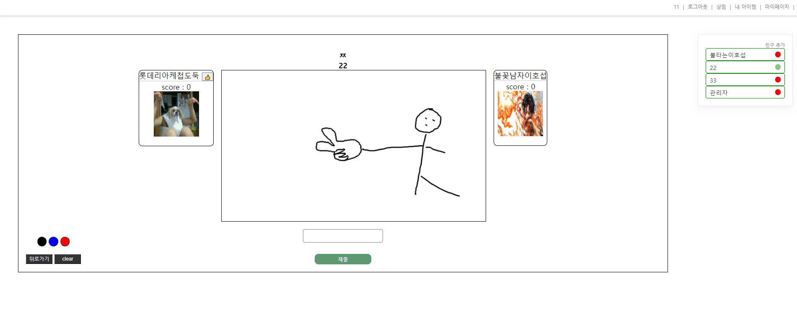
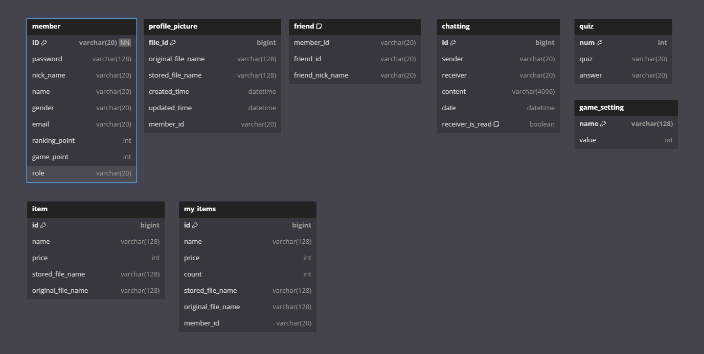

웹 소캣을 활용하여 만든 캐치마인드 게임 기반 프로젝트 입니다.

그림을 그리는 사람은 quiz의 답을 볼 수 있고, 맞추는 사람은 quiz의 초성만 볼 수 있습니다.
웹 소캣을 사용하여 실시간공유로 그림을 그리고 제한시간 안에 
정답을 맞추는 게임입니다.(현재 최대 3인)

------------------------------------------------------------------------------

[사용]
Spring Boot(3.2.6 ver), Mysql(8.0 ver), intelliJ, 
java 17.ver, html, js, web-socket, jpa

------------------------------------------------------------------------------

[시스템 구성도]

------------------------------------------------------------------------------

[ERD]
@OneToOne, @OneToMany 등 연관관계는 아직 고려중.
꼭 필요하지 않으면 사용하지 않을 예정.

------------------------------------------------------------------------------

[회원가입 화면]
체크하여 성공하는 방식에서. 키보드에서 입력이 일어날 때 마다 비동기 적으로 
체크하는 방식으로 수정 할 예정.

------------------------------------------------------------------------------

[로그인 화면]

------------------------------------------------------------------------------

[메인 화면]

- 로그아웃
- 상정
- 내 아이템
- 마이페이지
- 친구추가
- 친구 online, offline 표시
- 1대1 채팅
- 1대1 채팅 알림 표시
- 게임 매칭

------------------------------------------------------------------------------

[상점]
- 게임 포인트로 아이템 구매

------------------------------------------------------------------------------

[내 아이템] 화면입니다. 아이템을 사용하면 개수가 차감됩니다.

------------------------------------------------------------------------------

[마이페이지]
회원정보 수정 기능은 이후 만들 예정입니다.

------------------------------------------------------------------------------

[친구추가]

------------------------------------------------------------------------------

[채팅]

채팅을 전송하면 채팅을 받는 유저는 닉네임 오른쪽에 채팅 알림 숫자가 표시되어 
채팅이 왔는지 알 수 있습니다.
채팅을 확일 하면 알림 숫자가 사라집니다.

------------------------------------------------------------------------------

[관리자 페이지]
권한이 ROLE_ADMIN일 경우만 접근 가능합니다.

-프로필 사진 선택 : 회원가입 시 기본 프로필 사진 이미지를 설정할 수 있습니다.
-상점 아이템 등록 : 관리자가 상점에 아이템을 등록 할 수 있습니다.

-상점 아이템 삭제 : 관리자가 상점에 아이템을 삭제 할 수 있습니다.

-게임 설정 세팅 : 관리자가 게임 라운드의 시간 제한을 설정 할 수 있습니다.

------------------------------------------------------------------------------
