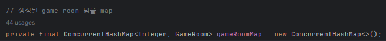
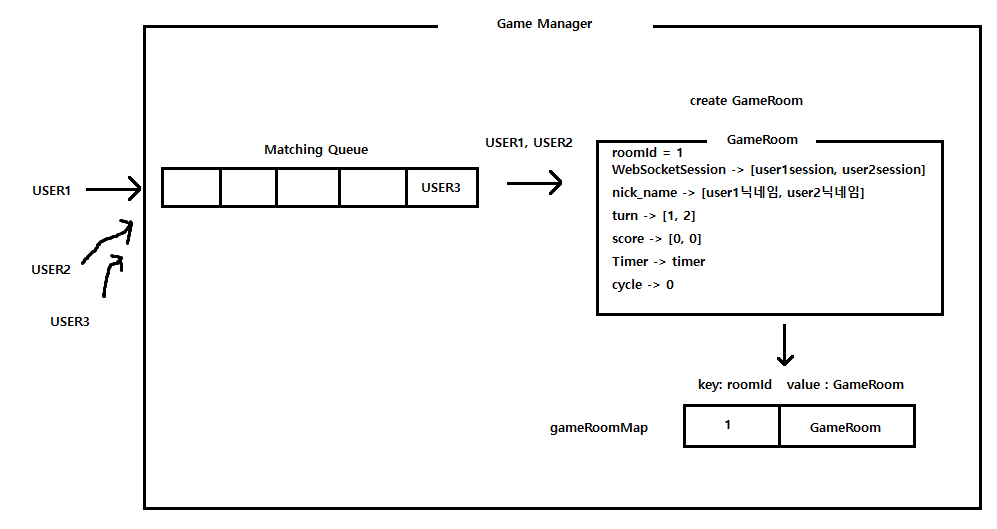

웹 소캣을 활용하여 만든 캐치마인드 게임 기반 프로젝트 입니다.

기여도 : 프론트[css 제외 100%] 백앤드[100%]
참여인원 : 2명

[링크] 아직 미흡하지만 배포하여 보았습니다.

http://54.180.115.155:8080/

[git clone 하여 사용 시]
최초에 시작시 member 테이블에 role 컬럼이 ROLE_ADMIN인 관리자 멤버를 생성하여
관리자 페이지 - 프로필 사진 선택 - 기본사진 선택 반드시 해주어야 합니다.

[테스트 방법]
혼자서 해볼 경우에는 회원가입으로 아이디 2개 만드신 다음에 하나는 기본 브라우저로
다른 하나는 시크릿 브라우저로 하여 2인 게임을 테스트 해 볼 수 있습니다.

그림을 그리는 사람은 quiz의 답을 볼 수 있고, 맞추는 사람은 quiz의 초성만 볼 수 있습니다.
웹 소캣을 사용하여 실시간공유로 그림을 그리고 제한시간 안에 
정답을 맞추는 게임입니다.(현재 최대 3인)

[게임 화면]

 

------------------------------------------------------------------------------

[사용]

Spring Boot(3.2.6 ver), Mysql(8.0 ver), intelliJ, 
java 17.ver, html, js, web-socket, jpa

------------------------------------------------------------------------------

[시스템 구성도]

------------------------------------------------------------------------------

[ERD]

------------------------------------------------------------------------------

게임 시스템.

[GameManager 클래스]

게임을 시작하려면 여러가지 기능이 필요합니다.

-매칭 시작/취소

-GameRoom 생성/제거

-퀴즈 전송

-score 합산

-유저 게임 순서 관리

-정답체크 및 점수추가 

-GameRoom 별 라운드 시간을 보내주는 Timer관리

-게임 도중 소캣 연결이 끊어진 유저 처리

-칭찬유저 점수 처리

-게임 종료시 ranking_point와 game_point부여

위 기능을 수행하여주는 GameManager 클래스를 만들어 관리하였습니다.

[매칭 시작/취소]

매칭 시스템은 멀티 스레드 환경을 고려하여 멀티 스레드 환경을 고려하여 ConcurrentLinkedQueue 사용하였습니다.

소캣에 연결되어있는 유저가 매칭요청을 보내면 Queue에 추가하고 게임 인원수를 만족하면

게임인원 수 만큼 유저를 꺼내어 매칭되도록 하였습니다.

매칭 도중 취소하면 Queue에서 제거하였습니다.

[GameRoom 클래스 생성/제거]

매칭에 성공하여 게임을 시작하면 같이 매칭 된 유저들 끼리만 소통하여 게임을 진행합니다.

매칭 된 유저들 끼리 소통하기 위해 GameRoom클래스를 만들어 관리하였습니다.

매칭에 성공하면 AtomicInteger을 사용한 roomIdGenerator를 통해 GameRoom을 식별 할 수 있는 roomId를 생성합니다.

그 다음 GameRoom을 생성하여 매칭된 유저들의 socket session, 닉네임 등 을 저장합니다.

roomId생성과 GameRoom생성하여 정보 저장까지 완료하면 gameRoomMap<rommId, GameRoom>에 추가하여 관리합니다.

[인게임 기능]

-게임시작

매칭 성공, GameRoom생성까지 완료하면 퀴즈 데이터를 전송하고 5초 후 게임을 시작합니다.

유저는 turn = 1인 유저부터 퀴즈의 답을 보고 그림을 그려 문제를 냅니다.(제한시간 90초)

그리는 그림은 실시간으로 공유됩니다.

90초동안 나머지 유저는 그림을 보고 답을 맞춥니다. 답을 맞추지 못하면 포인트를 획득하지 못합니다.

답을 맞추거나, 시간초가 끝나면 새로운 퀴즈 데이터를 전송하고 turn=2 인 유저가 그림을그려 문제를 냅니다.

그림을 그릴 때 색깔변경, 캔버스 clear, 뒤로가기 기능을 사용할 수 있습니다.

답을 맞추기 쉽도록 잘 그리면 닉네임 오른쪽 추천 버튼을 클릭하여 칭찬을 해줄 수 있습니다.(칭찬시 +5점)

게임 도중 소캣연결이 종료되면 해당 유저의 status를 0으로 바꾸고 status가 0 인 유저는 모든 순서를 건너뛰어

게임에 지장이 없도록 하였습니다. 하지만 혼자서는 할 수 없는 게임이기 때문에 혼자 남게 되면 강제로 게임을 종료하고

gameRoomMap<rommId, GameRoom>에 저장된 정보를 제거합니다.

-게임종료

위 과정을 반복하여 cycle만큼 순서가 돌면 게임이 종료되고 점수를 합산하여 랭킹포인트와 게임포인트를 지급합니다.

이후 gameRoomMap<rommId, GameRoom>에 저장된 정보를 제거합니다.

------------------------------------------------------------------------------

[채팅 시스템]

 

친구추가를 마친 후 친구의 닉네임 공간을 클릭하면 우측하단에 채팅 공간이 생성되고

실시간으로 채팅을 할 수 있습니다.

먼저 소캣에 연결된 유저가 채팅을 전송하면 

 

보낸사람, 받는사람, 내용, 시간, 확인여부를(default=0) DB에 저장합니다.

채팅을 받는 사람이 현재 소캣에 연결되어 있다면

닉네임 옆에 숫자를 표시하여 채팅수신 여부를 확일 할 수 있습니다.

 

채팅을 확인하면 확인여부를 1로 변경하고 알림 숫자가 사라집니다.

------------------------------------------------------------------------------

[회원가입 화면]

체크하여 성공하는 방식에서. 키보드에서 입력이 일어날 때 마다 비동기 적으로 

체크하는 방식으로 수정 할 예정.(수정완료.)

------------------------------------------------------------------------------

[로그인 화면]

------------------------------------------------------------------------------

[메인 화면]

- 로그아웃

- 상정

- 내 아이템

- 마이페이지

- 친구추가

- 친구 online, offline 표시

- 1대1 채팅

- 1대1 채팅 알림 표시

- 게임 매칭

------------------------------------------------------------------------------

[상점]

- 게임 포인트로 아이템 구매

------------------------------------------------------------------------------

[내 아이템] 화면입니다. 아이템을 사용하면 개수가 차감됩니다.

 

 

------------------------------------------------------------------------------

[마이페이지]

회원정보 수정 기능은 이후 만들 예정입니다.

------------------------------------------------------------------------------

[친구추가]

 

------------------------------------------------------------------------------

[관리자 페이지]

권한이 ROLE_ADMIN일 경우만 접근 가능합니다.

-프로필 사진 선택 : 회원가입 시 기본 프로필 사진 이미지를 설정할 수 있습니다.

-상점 아이템 등록 : 관리자가 상점에 아이템을 등록 할 수 있습니다.

-상점 아이템 삭제 : 관리자가 상점에 아이템을 삭제 할 수 있습니다.

 

 

-게임 설정 세팅 : 관리자가 게임 라운드의 시간 제한을 설정 할 수 있습니다.

------------------------------------------------------------------------------

